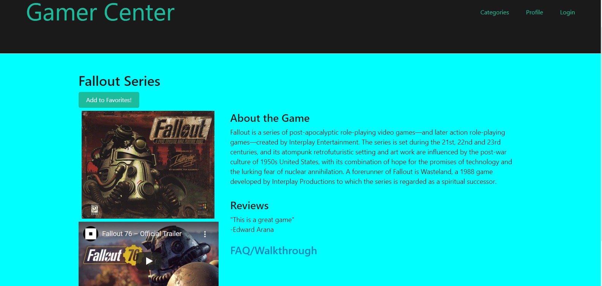

# Gamer Center

## License

[](https://opensource.org/licenses/MIT)




## Live Application

https://agile-spire-35058.herokuapp.com/


## Technology Used

* Javascript
* Handlebars
* CSS
* Node.js
* bcrypt NPM Package
* connect-session-sequelize NPM Package
* dotenv NPM Package
* email-validator NPM Package
* email-verifier NPM Package
* express NPM Package
* express-handlebars NPM Package
* express-session NPM Package
* mysql2 NPM Package
* sequelize NPM Package
* MySQL Database


## Description

As gamers we are tired of visiting sites that are funded or influenced by the companies/studios that make these games.
We want to help gamers with an unbiased all in one place to review games, buy/sell games & equipment, and interact with other gamers.
We want to create a place where gamers feel like gamers, NOT consumers.

## Installation

1. Clone the Repo
  ```sh
  git@github.com:codyregis6891/gamer-center.git
  ```
2. All NPM packages required for this application are already listed as dependencies in the package.json file. Run the command 'npm i' command in your terminal at the root    directory level to install the packages.

3. Seed your Database by entering node seeds/seed.js in the command line.

4. Ensure you have Node.js installed on your machine. The application will be invoked by entering node server.js in the command line.

5. You will see "App running!" in the console. You can then view the app on http://localhost:3001/.


## Questions or Issues?

* Email: codyregis6891@gmail.com
* https://github.com/codyregis6891/gamer-center/issues

